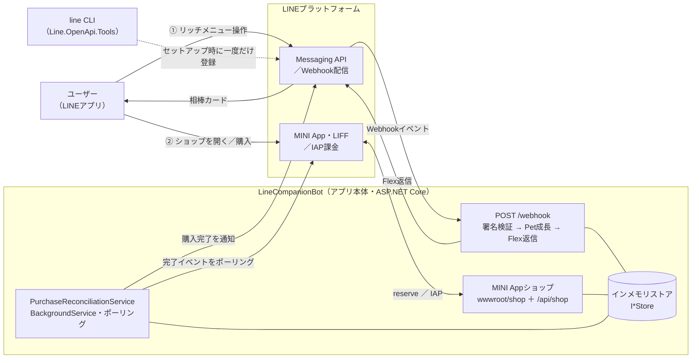

[← 索引](README.md) | [第1章 →](01-project-skeleton.md)

# はじめに — ゼロから雛形を作る

LINE固有のコードに入る前に、この章では空のフォルダから、Visual Studio Codeで実行・デバッグできる
ASP.NET Coreアプリまでを立ち上げます。まだ`Line.OpenApi.*`固有の要素は登場しません。以降のすべての
章が土台にする、素の.NETプロジェクトの形を用意する章です。

その前に、これから作るものと、その全体の構成を先に見ておきましょう。

## 今回作るもの

作るのは、1匹のバーチャルな相棒（ペット）を育てるLINE Botと、その世話に使うアイテムを買える
ショップを1つにまとめたアプリです。ユーザーの操作は大きく2つあります。

- **チャットで相棒を世話する。** リッチメニューの「ごはん」「あそぶ」「ステータス」をタップすると、
  相棒のお腹（Hunger）と機嫌（Happiness）が変化し、現在の状態がFlexカードで返ってきます。世話を
  重ねると経験値が貯まり、レベルが上がっていきます。
- **ショップでアイテムを買う。** リッチメニューのショップボタンからMINI Appを開き、レアな餌
  「Golden Kibble」やスキンをアプリ内課金（IAP）で購入できます。購入が完了すると、その旨がチャットへ
  通知され、買ったアイテムは相棒の世話に使えるようになります（例: Golden Kibble を与えるとお腹が
  一気に満タンになります）。

## システムの構成

システムは、次の要素で構成されます。

- **アプリ本体（`LineCompanionBot`）** — 1つのASP.NET Coreアプリに、入り口が2つあります。
  - **Webhook受信（`POST /webhook`）** — Messaging APIから届くイベントを受け取り、署名を検証し、
    Pet成長エンジンを動かして、Flexカードで返信します（第2〜4章）。
  - **MINI Appショップ** — LINEアプリ内で開く静的フロントエンド（`wwwroot/shop`、LIFF SDKを利用）と、
    それを支えるバックエンド（`/api/shop`、購入のreserve契約）です（第6章）。
  - 加えてバックグラウンドで **`PurchaseReconciliationService`** が動きます。IAPにはpush webhookが
    無いため、`GetWebhookEventsAsync` を定期ポーリングして購入完了を検知し、アイテムを付与して通知
    します（第7〜8章）。状態はすべて `I*Store` の裏のインメモリ実装で保持します（第3・6章）。
- **LINEプラットフォーム** — Messaging API（返信・push・Webhook配信）と、MINI App/LIFFランタイム
  および IAP課金を提供します。アプリ本体はLINEとの通信をすべて `Line.OpenApi.*` パッケージ
  （`Messaging` / `Messaging.Webhook` / `MiniApp`）経由で行います。
- **`line` CLI（`Line.OpenApi.Tools`）** — リッチメニューの登録に使う外部ツールです。これは実行中の
  アプリの一部ではなく、セットアップ時に一度だけ実行する独立した管理操作です（第5章）。

これらの関係と、2つの主要な流れ（①世話、②購入）を図にすると次のとおりです。



> アプリ本体とLINEプラットフォームの間の矢印は、いずれも `Line.OpenApi.*` パッケージ越しのやり取り
> です。以降の章では、この図の各ブロックを1つずつ組み立てていきます。

## 前提条件

- **.NET 10 SDK** — `dotnet --version` で確認しておきましょう（`10.*` が表示されるはずです）。
- **Visual Studio Code** と **C# Dev Kit** 拡張（`ms-dotnettools.csdevkit`）。このチュートリアルが
  前提とするデバッガ・テストランナー・ソリューションビューが、これで揃います。後で追加する
  `.vscode/extensions.json` を置いておくと、フォルダを開いたときにVS Codeがインストールを促して
  くれます。
- LINE Messaging APIチャネルとMINI Appチャネルは、[第9章](09-end-to-end.md)まで**不要**です。
  それ以前はすべて、LINEアカウント無しで動きます。

> **任意 — 早めに実接続する。** このチュートリアルはオフライン先行で、第1〜8章はLINEアカウント無しで
> ローカル検証できます。作りながら返信やリッチメニューを実機で見たい場合は、Messaging APIチャネルと
> アクセストークン、dev tunnelを先に用意し（コンソールとトンネルの手順は[第9章](09-end-to-end.md)）、
> 第2章以降はチャネルのWebhookを自分のトンネルに向けます。注意点が2つあります。ショップ/IAP側は審査を
> 通したMINI Appチャネルが必要で（第6・9章）、ブレークポイントで止めると約1分のリプライトークンが
> カード送信前に失効することがあります。

## ソリューションとプロジェクトを作る

リポジトリを置くディレクトリから、次を実行します:

```powershell
dotnet new sln -n LineCompanionBot

# Web アプリ（SDK: Microsoft.NET.Sdk.Web）。net10.0 が対象。
dotnet new web -o src/LineCompanionBot -f net10.0

# テストプロジェクト。ユニットテストの価値があるのは第3章の部分だけ。
dotnet new xunit -o tests/LineCompanionBot.Tests -f net10.0

dotnet sln add src/LineCompanionBot tests/LineCompanionBot.Tests
dotnet add tests/LineCompanionBot.Tests reference src/LineCompanionBot
```

`dotnet new web` が生成するのは、最小のASP.NET Coreテンプレートです。"Hello World!"を返す1行だけの
`Program.cs` で、第1章で置き換えますが、いまは動作確認済みの出発点として役立ちます。

続いて、アプリプロジェクトに`Nullable`と`ImplicitUsings`を設定します（どちらも後の章で使います）。
`src/LineCompanionBot/LineCompanionBot.csproj` を編集します:

```xml
<PropertyGroup>
  <TargetFramework>net10.0</TargetFramework>
  <Nullable>enable</Nullable>
  <ImplicitUsings>enable</ImplicitUsings>
</PropertyGroup>
```

## LINEパッケージを追加する

今回は `Line.OpenApi.*` のうち、下記の3つを使います:

```powershell
dotnet add src/LineCompanionBot package Line.OpenApi.Messaging --version 1.0.0
dotnet add src/LineCompanionBot package Line.OpenApi.Messaging.Webhook --version 1.0.0
dotnet add src/LineCompanionBot package Line.OpenApi.MiniApp --version 1.0.0
```

## VS Codeで開いて実行・デバッグを設定する

フォルダを開きます（`code .`）。`.vscode/` フォルダを作り、F5実行を動かす3つのファイルを置きます。
リファレンス実装リポジトリの
[`.vscode/`](https://github.com/pierre3/line-companion-bot/tree/main/.vscode) にある
`launch.json`・`tasks.json`・`extensions.json` を、自分のプロジェクトの `.vscode/` にコピーして
ください:

- **`launch.json`** — 「Run LineCompanionBot」構成が1つ。まずビルドし（`preLaunchTask`）、
  デバッガをアタッチしてアプリのDLLを起動し、`ASPNETCORE_ENVIRONMENT=Development` を設定し、
  プロジェクトフォルダを作業ディレクトリとして実行します。これで `appsettings.json` が相対パスで
  解決されます。
- **`tasks.json`** — `build`・`test` の各タスク。（第5章のリッチメニュー登録は、VS Code タスクではなく
  独立した `line` グローバルツールを使います。）
- **`extensions.json`** — C# Dev Kitを推奨します。

## シークレット: チェックインするファイルではなく `dotnet user-secrets` を使う

LINEのチャネルシークレットとアクセストークンは機密情報です。`appsettings.json` や `launch.json`
には決して入れないでください。フレームワークが推奨するローカルの保管場所は**ユーザーシークレット**、
つまりリポジトリツリーの外に置かれ、`UserSecretsId` でプロジェクトに紐づく `secrets.json` です。

有効化は一度だけで済みます:

```powershell
dotnet user-secrets init --project src/LineCompanionBot
```

これで`.csproj`に`<UserSecretsId>`（生成されたGUID）が書き込まれます。この値は安定した識別子で
あればよく、このリポジトリが読みやすい文字列を使っていても問題ありません。実際のシークレットの設定は
[第9章](09-end-to-end.md)まで不要ですが（それ以前に実トークンを必要とする処理はありません）、
仕組みだけ先に用意しておけば、後の章では単に「user-secretsに入れる」と書くだけで済みます。第1章では、
`CompanionSettings` をこの保管場所から読ませる`Program.cs`の1行を示します。

## 最初の実行

それでは**F5**を押します。VS Codeがビルド・起動し、（`serverReadyAction` により）待ち受けURLで
ブラウザを開きます。デフォルトテンプレートは `http://localhost:5091/` で `Hello World!` を返します。
`Program.cs` にブレークポイントを置いてリロードし、デバッガが止まることを確かめてください。これが、
以降の各章で繰り返していく内側ループです。

確認できたらアプリを停止します（赤い四角、または `Shift+F5`）。次章では、このHello-Worldの骨組みを、
実際の設定とDIの形に置き換えていきます。
